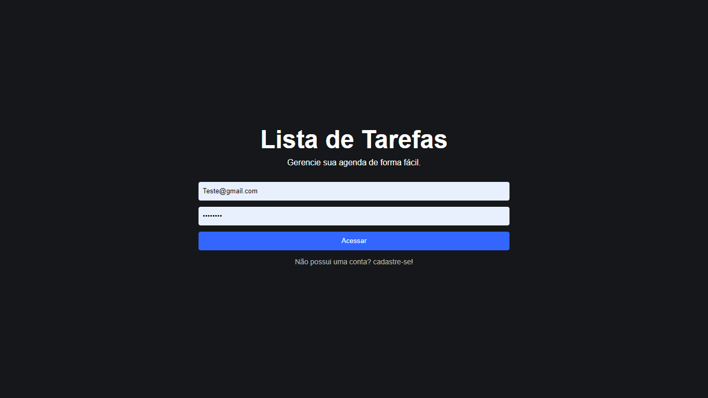

### Prime-flix-65
 

 
    

- Um programa feito com React JS, React Routes e Firebase para criar a simulação real de login, criação de contas e dados de acordo com a conta logada!. 
- Os dados da aplicação ficarão salvos no Firebase, react routes servirá para criar rotas/páginas na nossa aplicação React.

Deploy: https://wondrous-kleicha-ac1c5f.netlify.app

## Atualização:
Novas funcionaliades: 
 1 - Atualização no componente Admin. 
 2 - Possibilidade de adicionar novas tarefas. 
 3 - Funcionalidade de editar e concluir tarefas. 
 4 - Contas salvas no banco de dados do firebase. 

## Instalação
Para instalar o programa, siga estas etapas:

1- Clone o repositório para sua máquina local.
2- Instale as dependências com npm install.
3- Execute o programa com npm start.

## Como usar
Para usar o programa, abra-o em um navegador e navegue pelas diferentes páginas para ver o sistema de criação de conta e de login.

## Estrutura do projeto
Os arquivos principais do projeto estão localizados na pasta "src". O arquivo App.js contém a lógica principal do programa, enquanto os páginas individuais estão localizados na pasta "pages".

## Contribuição
Contribuições são bem-vindas! Sinta-se à vontade para enviar pull requests com correções de bugs, novos recursos ou melhorias na documentação.
